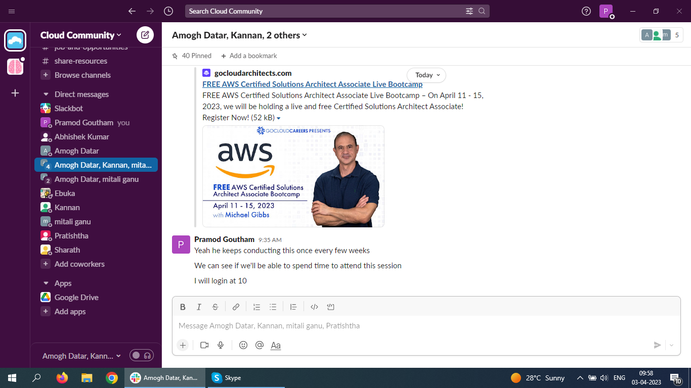

# Writing good documentation

## Step 1 - Using Code Blocks

Code blocks in markdown make it *very easy* for tech people to **copy, paste and share** code. 
A good __cloud engineer__ user code blocks wherener possible.
Because it allows others to copy and paste their code to replicate or research issues.

- In order to create code blocks in markdown you need to use three backticks (`)
- Not to be confused with quotation (')

```c#
using System;

class Program
{
    static void Main()
    {
        int dividend = 10;
        int divisor = 0;

        try
        {
            int result = dividend / divisor;
            Console.WriteLine($"Result: {result}");
        }
        catch (DivideByZeroException ex)
        {
            Console.WriteLine($"Error: {ex.Message}");
        }
    }
}
```

When you can, you should attempt to apply syntax highlighting to your code blocks. 
Good cloud engineers use code blocks for both code and errors that appear in the console.

```
Error: Attempted to divide by zero.
```
> Here is an example of using a code block for an error that appears in bash.

<!--  -->


- [x] Finish Step 1
- [x] Finish Step 2
- [ ] Finish Step 3

# Step 4 - Use Emojis (Optional)

Github Flavoured Markdown (GFM) supports emoji shortcodes. Here are some examples:
| Name | Shortcode | Emoji |
| --- | --- | --- |
| Cloud | `:cloud:` | :cloud: |




## References
- [Basic writing and formatting syntax (Github Flavoured Markdown)](https://docs.github.com/en/get-started/writing-on-github/getting-started-with-writing-and-formatting-on-github/basic-writing-and-formatting-syntax)
- [Github Flavoured Markdown - Emojis](https://github.com/ikatyang/emoji-cheat-sheet)
